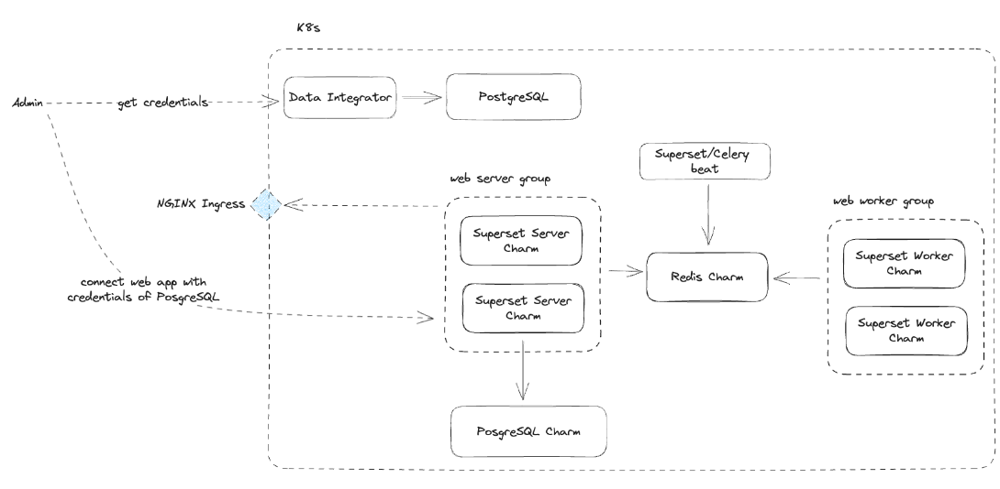

# Charmed Superset Architecture

The Charmed Superset ecosystem consists of a number of different charmed operators related together. The diagram below shows a high-level illustration of the different charms and their communication.The components are as follows:

- Superset Server and UI: The Superset server handles the main web interface (UI) and API interactions.
- Superset Beat: Superset Beat is responsible for running periodic tasks like scheduling SQL Lab query cleanup, cache warmups, and other timed jobs.
- Superset Worker: The Superset Worker handles background tasks such as running asynchronous queries, processing scheduled reports, and managing long-running jobs.
- PostgreSQL K8s: For Superset persistence of metadata, we use the PostgreSQL K8s charmed operator. The PostgreSQL K8s charm can be deployed and related to the Superset server.
- Nginx Ingress Integrator: The Charmed Superset K8s operator exposes its service ports using the Nginx Ingress Integrator charmed operator.
- S3 Integrator: The Charmed Superset K8s operator can be used to enable event histories archival in an S3-compatible storage by relating it to the S3 Integrator charmed operator.
- Redis K8s: Redis is used as a broker for Celery tasks in Superset. It manages the messaging system that queues tasks between the Superset web interface (where jobs are submitted) and the workers (where jobs are processed).

