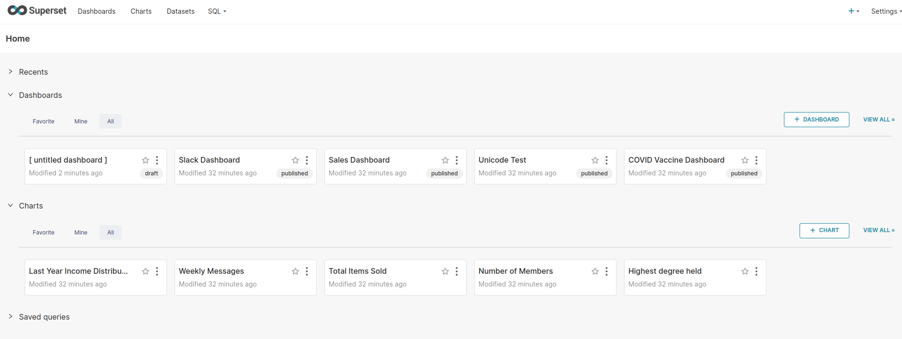
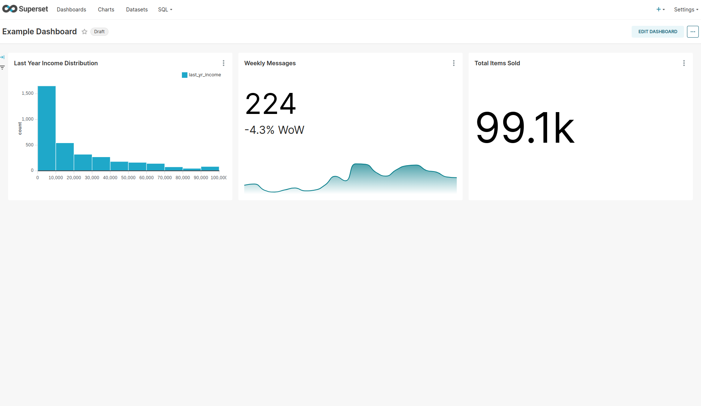

# Create a dashboard

This part of the tutorial focuses on accessing the User Interface (UI) and creating a dashboard.

## Add example data
In order to create a dashboard you first need some data. Charmed Superset comes with the option to import test data for experimentation via a configuration parameter. You can do so as follows:
```bash
juju config superset-k8s load-examples=True
```

[note]
This may take some time, up to 5 minutes.
[\note]

Once completed, `juju status` shows the `superset-k8s/0` unit with `Message`: `Status check: UP`.

```
Model           Controller           Cloud/Region        Version  SLA          Timestamp
superset-model  superset-controller  microk8s/localhost  3.5.3    unsupported  11:05:51+01:00

App                  Version  Status       Scale  Charm           Channel        Rev  Address         Exposed  Message
postgresql-k8s       14.12    active           1  postgresql-k8s  14/stable      381  10.152.183.243  no       
redis-k8s            7.2.5    active           1  redis-k8s       latest/edge     36  10.152.183.182  no       
superset-k8s                  active           1  superset-k8s    latest/stable   31  10.152.183.135  no       Status check: UP

Unit                    Workload     Agent  Address      Ports  Message
postgresql-k8s/0*       active       idle   10.1.255.10         Primary
redis-k8s/0*            active       idle   10.1.255.21         
superset-k8s/0*         active       idle   10.1.255.5          Status check: UP
```

## Access the UI
You can now access the UI via the `superset-k8s/0` address, port 8088. You can do this by opening a browser to `<unit-ip>:8088`, in this example `10.1.255.5:8088`, and logging-in with the username/password `admin/admin`.



## Create a dashboard
A dashboard is made up of at least one chart. You have pre-loaded some data including some ready made charts in the previous steps. Add some of these charts to your dashboard by following the steps below:

1. Start by clicking `+ Dashboard` on the welcome page. This opens a new draft dashboard.
2. Select `Edit Dashboard` and drag and drop the top three charts into the dashboard.
3. Give your dashboard a name. For instance, `Example dashboard`.
4. Save your dashboard.
5. Click the `Draft` button to turn it from a draft to a published dashboard.



**See next:
[Cleanup & Next Steps](06-cleanup.md)**