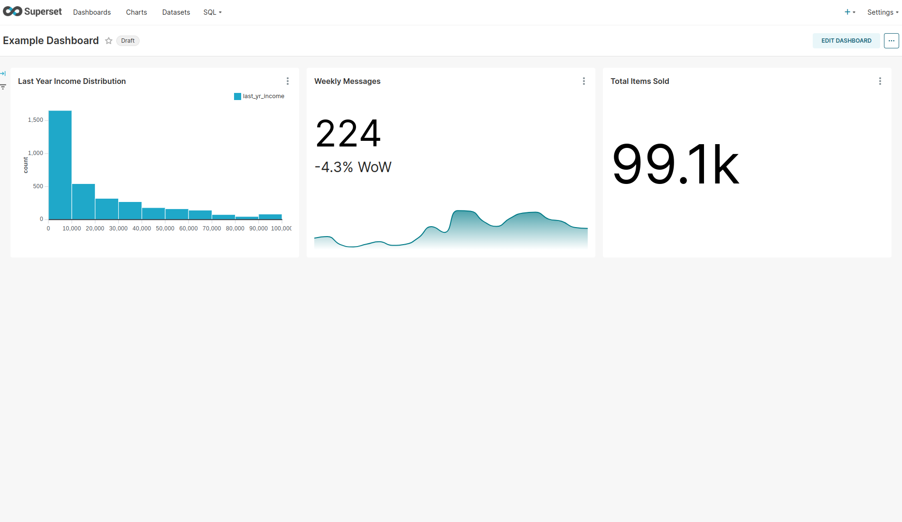

# Creating a Dashboard

This is part of the
[Charmed Superset Tutorial]().
Please refer to this page for more information and the overview of the content.

## Adding Example Data
In order to create a dashboard we first need some data. Charmed Superset comes with the option to import test data for experimentation via a configuration parameter.

```bash
# Note the`load-examples` configuration parameter is set to `False`.
juju config superset-k8s

# Update this value to `True`
juju config superset-k8s load-examples=True
```
This will take some time (up to 5 minutes). We'll know it's been completed when the
`juju status` shows us `superset-k8s/0` unit with `Message`: `Status check: UP`.


## Accessing the UI
We can now access the UI via the `superset-k8s/0` address, port`8088`. You can do this by opening a browser to `<unit-ip>:8088` (in this example `10.1.255.5:8088`) and logging-in with the username/password `admin/admin`. 

```
Model           Controller           Cloud/Region        Version  SLA          Timestamp
superset-model  superset-controller  microk8s/localhost  3.5.3    unsupported  11:05:51+01:00

App                  Version  Status       Scale  Charm           Channel        Rev  Address         Exposed  Message
postgresql-k8s       14.12    active           1  postgresql-k8s  14/stable      381  10.152.183.243  no       
redis-k8s            7.2.5    active           1  redis-k8s       latest/edge     36  10.152.183.182  no       
superset-k8s                  active           1  superset-k8s    latest/stable   31  10.152.183.135  no       Status check: UP

Unit                    Workload     Agent  Address      Ports  Message
postgresql-k8s/0*       active       idle   10.1.255.10         Primary
redis-k8s/0*            active       idle   10.1.255.21         
superset-k8s/0*         active       idle   10.1.255.5          Status check: UP
```


## Creating a Dashboard
A dashboard is made up of at least 1 chart.We have pre-loaded data including some ready made charts, which we can now add to our dashboard by following the steps below:

1. Start by selecting `+ Dashboard` on the welcome page. This will open a new draft dashboard.
2. Select `Edit Dashboard` and drag and drop the top 3 charts into the dashboard.
3. Give your dashboard the name `Example Dashboard`
4. Save your dashboard
5. Click the `Draft` button to turn it from a draft to published dashboard



And that is it, congratulations on setting up your first dashboard!

> **See next:
> [Cleanup & Next Steps]()**